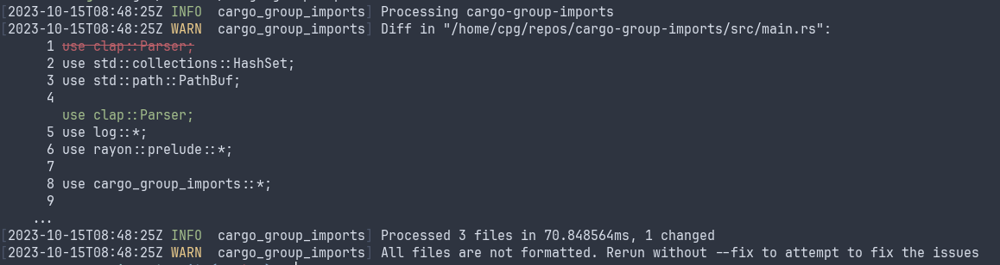

# cargo-group-imports

Group imports in workspace source files as:

```
Module imports/declarations

Standard library

External crates

Workspace crates

Crate modules
```

This roughly corresponds to the `group_imports` unstable rustfmt option, with the difference
that `rustfmt` does not distinguish workspace crates from external ones.

By default, displays a diff without applying changes, returning code 0 when no changes are
necessary.



The `--fix` flag allows applying the changes.

See also:

- <https://rust-lang.github.io/rustfmt/?version=v1.4.38&search=#group_imports>
- <https://github.com/rust-lang/rustfmt/blob/master/src/reorder.rs>

## Installation

```
$ cargo install --git https://github.com/cpg314/cargo-group-imports
```

## Usage

```
cargo group-imports [OPTIONS] [WORKSPACE]

Arguments:
  [WORKSPACE]  [default: current folder]

Options:
      --fix   Apply changes
  -h, --help  Print help (see more with '--help')
```
